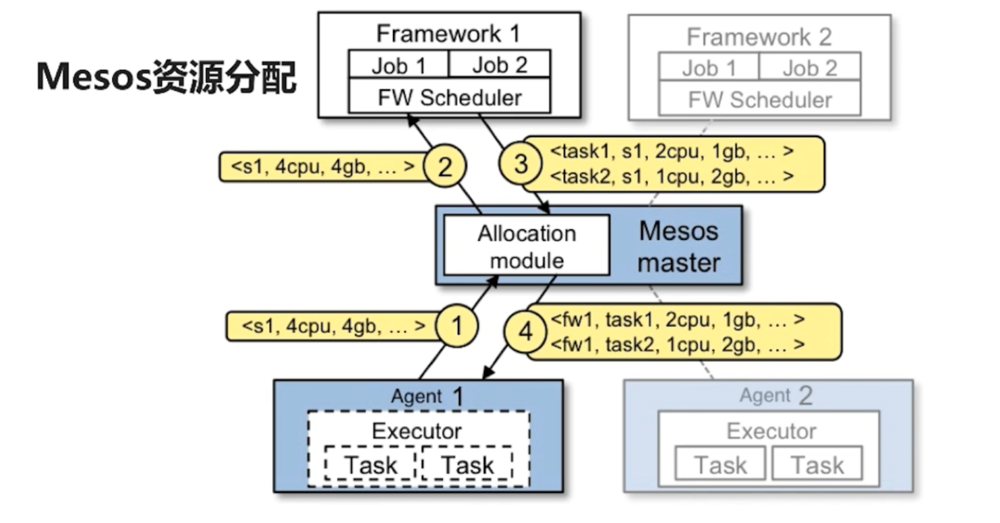
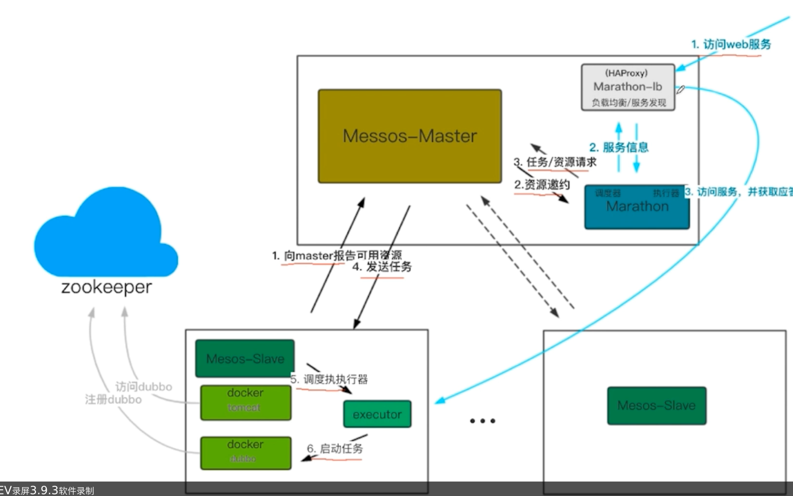

# 部署之前

## 调度

1. slave1(slave也称agent) 向 master 汇报空闲资源: 4cpu, 4gb 
2. 由 master 触发分配策略模块(framework), 得到(framework)使用资源的请求. master 向 framework 向framework 发送资源邀约, 描述 slave1 所有的可用资源.
3. framework 的调度器命令master, 需要在slave1上运行两个任务
    - 第一个认为是1cpu, 2g内存
    - 第二个任务是2cpu, 2g内存
4. master 向 slave 下发任务
5. 执行器启动两个任务
## 


1. slave 向 master 报告可用的资源
2. master向 framework 发送资源邀约
3. framework 向 master 发送任务/资源请求
4. master 向 slave 发送任务
5. slave 调度执行器
6. 启动任务


# 集群环境部署
1. 启动zk

```bash
sh zookeeper.sh

```

2. 启动mesos

```bash
# 启动主节点, 注意修改参数
sh mesos-master.sh
# 启动slave节点(可在多台机器启动), 注意修改参数
sh mesos-slave.sh

```

3. 启动marathon

```bash
sh marathon.sh
sh marathon-lb.sh
```

# 部署服务

## 服务发现

